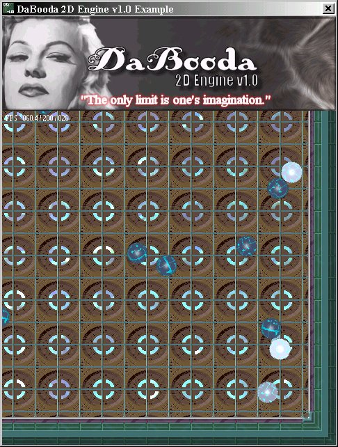



## DaBooda 2D Engine v1\.0

### Description

This is a multi purpose 2D engine that uses DirectX8. It provides support for Maps, Sprites, KeyBoard, JoyStick, Mouse Input, Full Audio Support including Directional Sound, Audio support for Midi and MP3's and many other helpful built in functions. All this in One simple to use dll. Sample and dll included. Enjoy...and i will have an extensive html help file Created and uploaded within a week.
 
### More Info
 

             |
---                |---
**Submitted On**   |2004-04-16 00:00:50
**By**             |[Andrew Stickney](https://github.com/Planet-Source-Code/PSCIndex/blob/master/ByAuthor/andrew-stickney.md)
**Level**          |Intermediate
**User Rating**    |5.0 (40 globes from 8 users)
**Compatibility**  |VB 5\.0
**Category**       |[Games](https://github.com/Planet-Source-Code/PSCIndex/blob/master/ByCategory/games__1-38.md)
**World**          |[Visual Basic](https://github.com/Planet-Source-Code/PSCIndex/blob/master/ByWorld/visual-basic.md)
**Archive File**   |[DaBooda\_2D1733984162004\.zip](https://github.com/Planet-Source-Code/andrew-stickney-dabooda-2d-engine-v1-0__1-53186/archive/master.zip)

